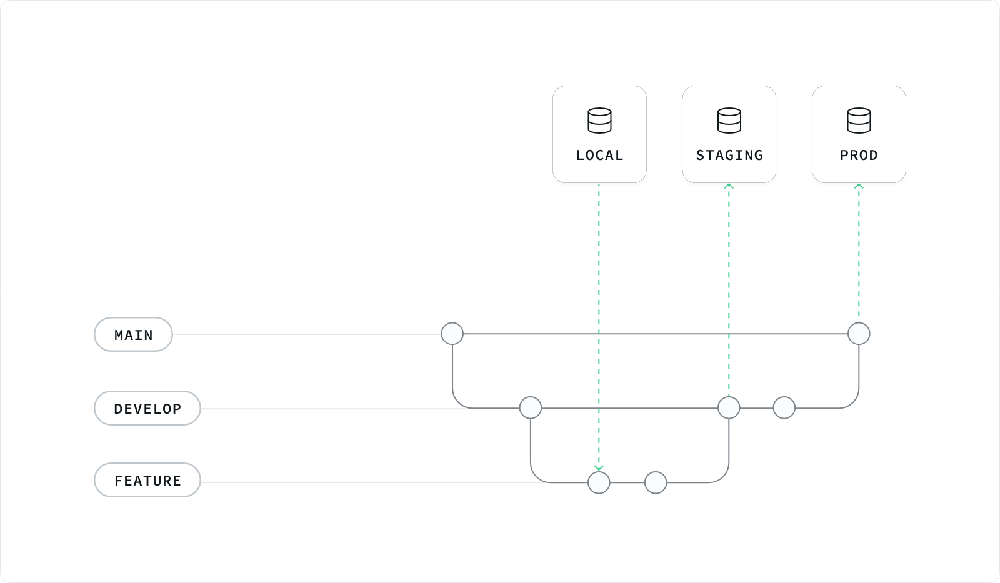

# Environments


Database **LOCAL** will correspond to **DEV**


<figure><figcaption>
Environment pipeline
</figcaption></figure>

1. **Development Environment**

* **Used by**: Developers.
* **Purpose**: Development and initial testing of new features.
* **Git branch:** Developers create **feature** branches from the **develop** branch.
* **Deployment**: Code is deployed frequently to the **development** environment to test changes.
* **Process**:
  * Developers code on **feature** branch and test locally.
  * Commit & Pull changes from **develop** branch (fix conflict if any).
  * Rebase **develop** branch to **feature** branch.
  * Create pull requests (PRs) for code reviews.
  * Merge approved PRs into the **develop** branch.
  * Git action will run deploy to **staging** environment.

***

2. **Staging Environment**

* **Used by**: QA, Internal Team.
* **Purpose**: This environment mirrors the production environment as closely as possible. It’s used for integration testing, QA, and final validation before deploying to production.
* **Git branch:** Code is merged from the **feature** branch to the **develop** branch.
* **Deployment:** CI/CD pipelines deploy code to the **staging** environment after successful merges to **develop** branch.
* **Process**:
  * Run migrations, configs, and secrets (if any)
  * Automated tests run on merged code.
  * Manual testing and QA validation.
  * Leader perform final acceptance testing.

***

3. **Production Environment**

* **Used by:** End-users & Limited to operations and select development team members.
* **Purpose:** This environment is live and used by end-users. It must be stable, secure, and performant.
* **Git branch:** Code is merged from the **develop** branch to the **main** branch.
* **Deployment**: CI/CD pipelines deploy code to the **production** environment after successful merges and final validation.
* **Process:**
  * Final smoke tests post-deployment.
  * Continuous monitoring for issues.
  * Rollback mechanisms are in place for critical issues.

***

